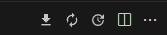

# stasher_app

A new Flutter project.

## Getting Started

## Steps to run:
1. clone [stasher_app](https://github.com/ericrvrjr/stasher_app)
2. if you are using vscode, open pubspec.yaml and click the "Get Packages Button" 
    
   ## --- OR ---
    
    if you are using a diferrent code editor, open terminal and run
   ```
    flutter pub get
   ```
3. duplicate .env.example to .env. **Note, you have to create the .env file on the root of the project.
4. Run the project.